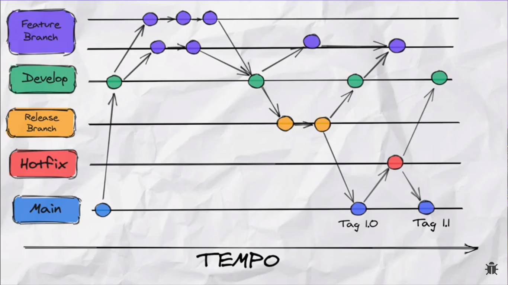

# How to use a git flow

## **Git Flow Floxogram**

    

---

## **Basic Comands**

### **To start a git flow**

_This command will start git flow in the project and set some branches and default settings_

    git flow init

The default defaul settings on create a new branch are:

- main -> [_the master and protected branch_]
- develop -> [_the development branch from which the features came_]
- feature/ -> [_the branch for developing a new feature_]
- hotfix/ -> [_the branch for bug fixing in production_]
- release/ -> [_the branch for validation of what was developed in the feature. Note: use a 'v' prefix in releases_]
- support/ -> [_the feature for support_]

### **To create a new feature**

_This command will create a new branch from the development branch and checkout the created branch_

    git flow feature start [name-your-feature]

### **To publish the feature on repository**

_This command will create push the created branch to the git remote repository_

    git flow feature publish [name-your-feature]

### **To finish the feature**

_This command will merge the created branch into the develop branch and delete the current branch, if the branch has been published in the remote repository, it will also be deleted from the repository_

    git flow feature finish [name-your-feature]

### **To generate a new release**

_This command will generate a new release version_

    git flow release start [release-version]

### **To publish the release in the master branch**

_This command will merge the release branch with the master branch and with the develop branch and will delete the created release branch_

    git flow release finish [release-version]
